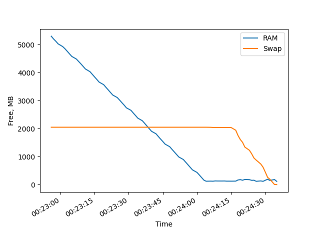
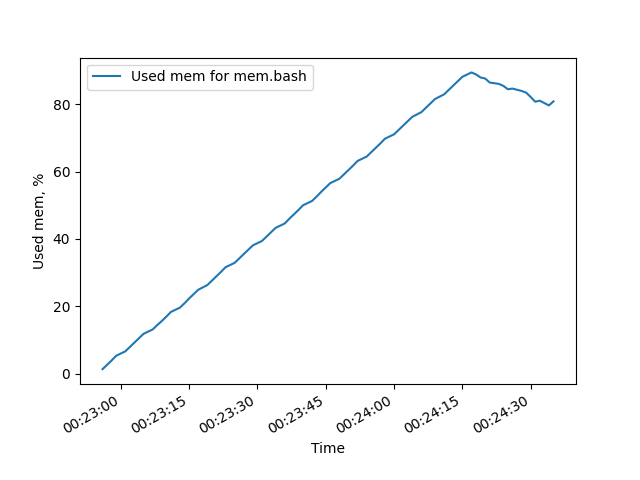
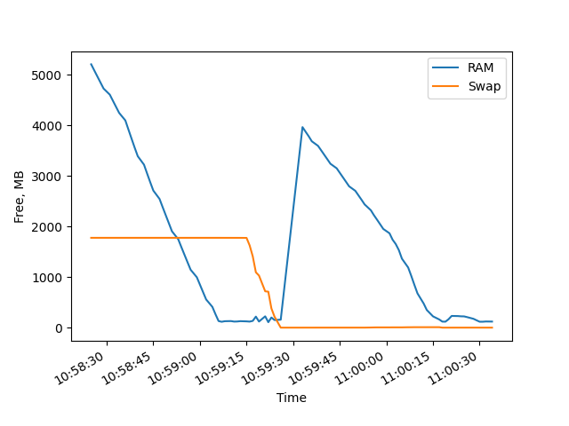
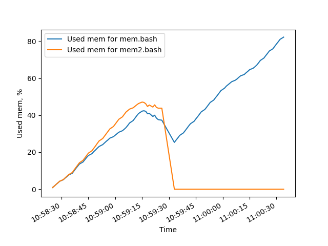

|   Параметры    | Значения   |
|:--------------:|------------|
| Total RAM      | 7106760 kB |
| Swap size      | 2097148 kB |
| Page size      | 4096 kB    |
| Free mem size  | 3930488 kB |
| Free swap size | 2097148 kB |

# Первый эксперимент

## Первый этап
Большую часть данных можно посмотреть в файле `./expr1/stage1/report.txt`, а также другие логи в `*.log` файлах.

Процесс сразу же попал на первую строчку top и оставался там до его завершения. Сначала использовалась физическая память, а когда она закончилась, стал использоваться раздел подкачки. При заполнении памяти на 82.2% процесс был завершён.

Вывод dmseg:
```
[  163.397912] Out of memory: Killed process 1932 (mem.bash) total-vm:7728744kB, anon-rss:5820796kB, file-rss:0kB, shmem-rss:0kB, UID:1000 pgtables:15160kB oom_score_adj:0
[  164.463505] oom_reaper: reaped process 1932 (mem.bash), now anon-rss:0kB, file-rss:0kB, shmem-rss:0kB
```

Последняя строка в файле `report.log`: `98000000`

### Графики



# Второй этап

Большую часть данных можно посмотреть в файле `./expr1/stage2/report.txt`, а также другие логи в `*.log` файлах.

Во втором этапе наблюдается похожая ситуация, как и в первом. Процессы заняли первую и вторую строчку top. Процессы находились в статусе `running`, пока в сумме не заняли 89.3% mem (42.4% и 46.9% соответственно для mem.bash и mem2.bash).

Вывод dmesg:
```
[ 1959.876617] Out of memory: Killed process 17405 (mem.bash) total-vm:7672248kB, anon-rss:5860416kB, file-rss:0kB, shmem-rss:0kB, UID:1000 pgtables:15056kB oom_score_adj:0
[ 1960.867929] oom_reaper: reaped process 17405 (mem.bash), now anon-rss:0kB, file-rss:0kB, shmem-rss:0kB
```

### Графики



Последняя строка в файле `report1.log`: `98000000`

Последняя строка в файле `report2.log`: `52000000`

# Второй эксперимент

`N=9800000 K=10` Все K запусков успешно отработали. Это обуславливается тем, что процессы успевают закончиться прежде, чем критическое потребление памяти. По мере завершения процессов происходит высвобождение памяти для следующих процессов.

`N=980000 K=30` При 30 запусках одновременно работают уже больше процессов. Старые не успевают завершиться, как появляются новые, из-за этого память быстро расходуется. В итоге многие процессы аварийно завершаются и освобождают физическую память для новых процессов. При запуске новых процессов старые процессы переходят в раздел подкачки как менее приоритетные и ждут своей очереди на выполнение, но это тоже не будет происходить бесконечно, так как размер буфера подкачки ограничен и выделяется для помощи оперативной памяти.

`N=7362500` Значение получено с помощью двоичного поиска между `N=9800000` и `N=3300000`. 3300000 - ближайшее сверху число к `98000000 / 30`, кратное 10^5 :).
